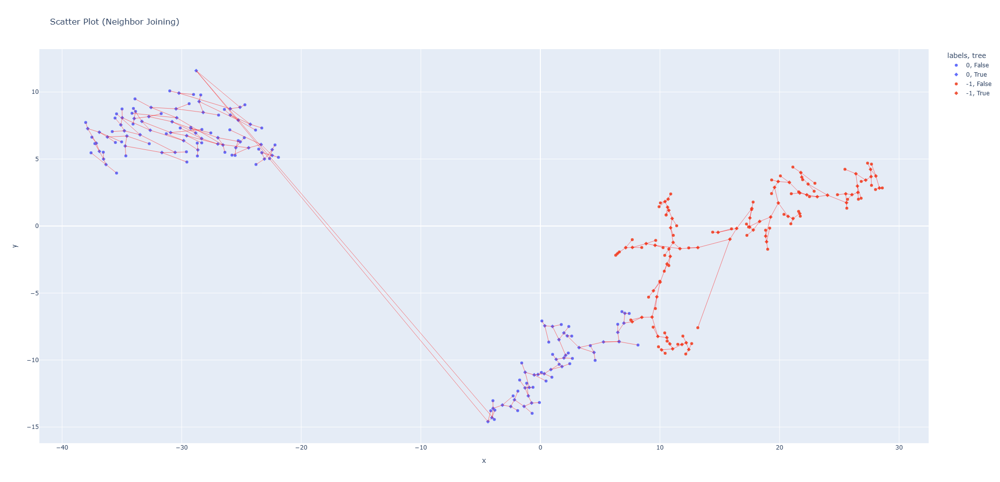
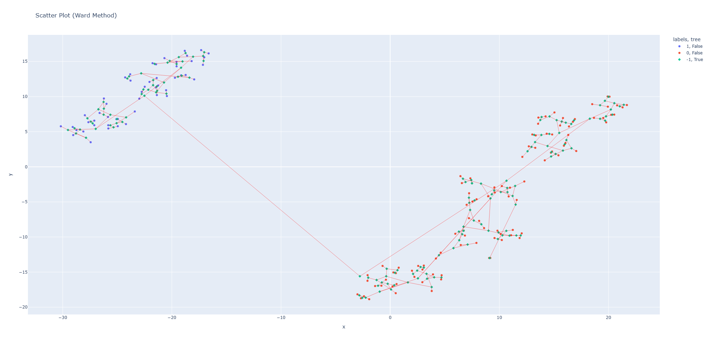
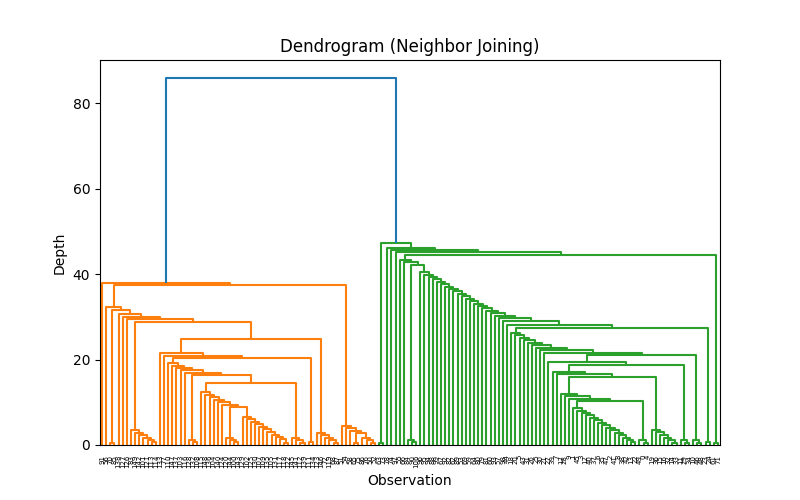
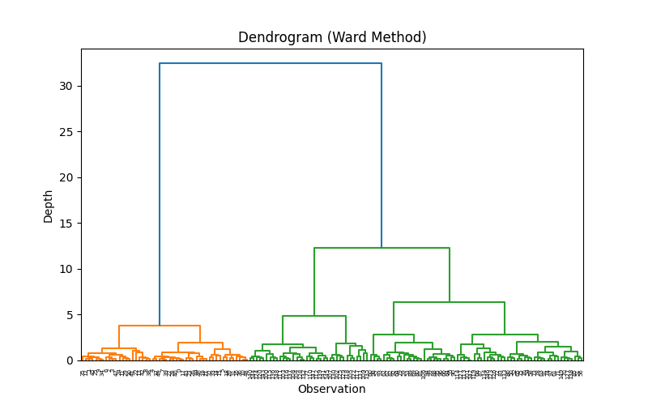
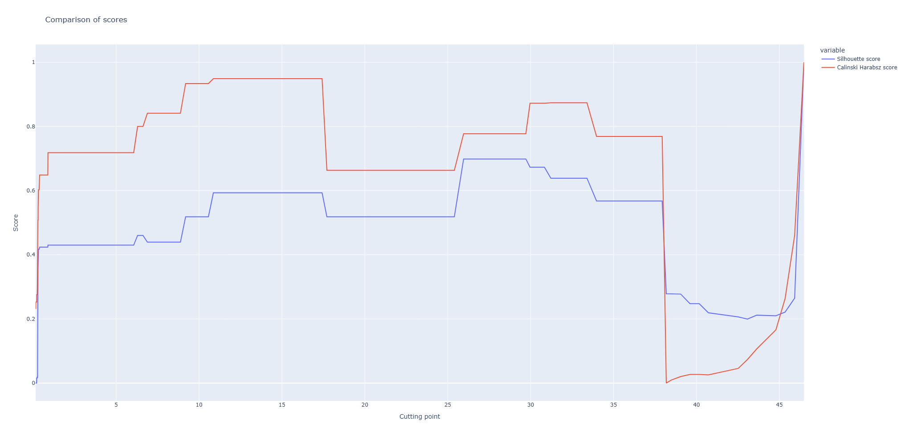

# Primerjava hierarhičnega gručenja s postopkom združevanja sosedov

Za izris slik je treba pognati `main.py`. Uporabljene knjižnice so `numpy`, `pandas`, `sklearn`, `scipy`, `matplotlib` in `plotly`.

## Razsevni diagrami
Kvadrati na razsevnem diagramu predstavljajo notranja vozlišča, krogi pa liste.

## Dendogrami

Primerjava vrednosti silhuete in Calinski-Harabasz ocene pri različnih točkah reza drevesa, ki ga proizvede algoritem združevanja sosedov.
